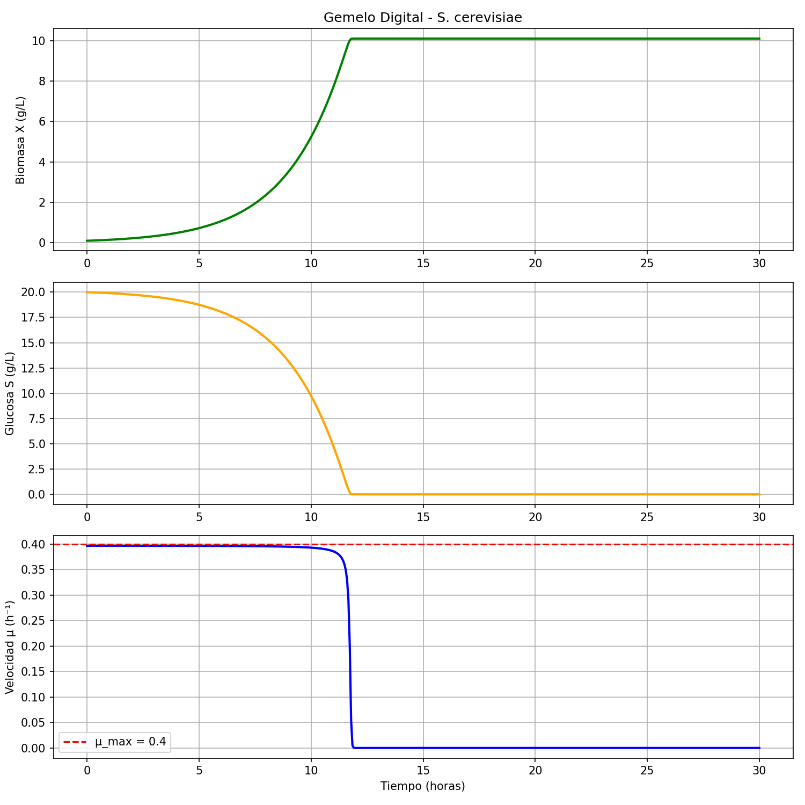

# BioReactor Digital Twin — *Saccharomyces cerevisiae*

A computational model simulating the batch fermentation kinetics of *Saccharomyces cerevisiae* 
using the Monod growth model, implemented in Python with interactive parameter exploration.

## Description

This project implements a digital twin of a batch bioreactor, numerically solving the coupled 
ODEs that describe biomass growth and substrate consumption over time. The model is calibrated 
with kinetic parameters reported in literature for *S. cerevisiae* grown on glucose at 30 °C, 
and includes an interactive dashboard for real-time parameter sensitivity analysis.

## Kinetic Model

The system is governed by two coupled ordinary differential equations:

$$\frac{dX}{dt} = \mu \cdot X$$

$$\frac{dS}{dt} = -\frac{\mu}{Y_{X/S}} \cdot X$$

Where the specific growth rate follows the Monod equation:

$$\mu = \mu_{max} \cdot \frac{S}{K_S + S}$$

## Kinetic Parameters — *S. cerevisiae*

| Parameter | Value | Units | Description |
|---|---|---|---|
| μ_max | 0.40 | h⁻¹ | Maximum specific growth rate |
| K_S | 0.18 | g/L | Monod saturation constant |
| Y_X/S | 0.50 | g/g | Biomass yield on glucose |
| S₀ | 20.0 | g/L | Initial glucose concentration (YPD medium) |
| X₀ | 0.10 | g/L | Initial biomass concentration (inoculum) |
| T | 30 | °C | Optimal growth temperature |

## Simulated Growth Curve



## Tech Stack

Python 3 · NumPy · SciPy · Matplotlib · ipywidgets · Jupyter Notebook

## How to Run

```bash
git clone https://github.com/samuelramirez-biotech/biorreactor-gemelo-digital
cd biorreactor-gemelo-digital
pip install numpy scipy matplotlib ipywidgets
jupyter notebook
```

## Author

Samuel Ramírez Tovar  
Ingeniería Biotecnológica — Universidad EIA, Medellín, Colombia
